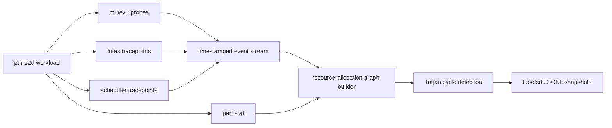

# Deadlock Resource-Allocation Graph Dataset

## Dataset summary

This dataset contains timestamped resource-allocation graph snapshots collected
from controlled pthread workloads running in an ARM64 Linux QEMU guest. It is
designed for graph classification experiments that distinguish `safe`,
`unsafe`, and `deadlocked` execution states.

In this document, **RAG means resource-allocation graph**, not
retrieval-augmented generation.

| Property | Value |
|---|---:|
| Version | `v1` |
| Collection date | 2026-07-25 |
| Curated experiment runs | 360 |
| Graph snapshots | 6,418 |
| Snapshot cadence | Every edge transition plus 20 ms while active |
| Train / validation / test runs | 216 / 72 / 72 |
| Approximate processed size | 12 MiB |
| Guest architecture | ARM64 (`aarch64`) |
| Guest kernel | Ubuntu `6.8.0-136-generic` |

The current processed dataset is stored in [`dataset/v1`](dataset/v1). Its
`run_manifest.jsonl` file provides run-level parameters and environment metadata.
Raw run artifacts remain under `runs/<run-id>/`.

### Processed file inventory

| File | Records | Purpose |
|---|---:|---|
| `train.jsonl` | 3,834 | Training graph snapshots. |
| `validation.jsonl` | 1,287 | Model-selection graph snapshots. |
| `test.jsonl` | 1,297 | Final evaluation graph snapshots. |
| `run_manifest.jsonl` | 360 | One metadata record per curated run. |
| `metadata.json` | 1 | Split membership, counts, curation exclusions, and split seed. |

JSONL files contain one compact JSON object per line and are UTF-8 encoded.

## Intended use

Appropriate uses include:

- Resource-allocation graph classification research.
- Deadlock-cycle detection baselines.
- Evaluation of temporal `safe` / `unsafe` / `deadlocked` labeling.
- Experiments with heterogeneous GNNs containing thread and lock node types.
- Sensor-recall studies comparing workload ground truth with eBPF observations.

The dataset is not intended to represent arbitrary production applications,
kernel-space lock deadlocks, distributed deadlocks, or synchronization
primitives other than the observed pthread/futex behavior. It must not be used
as evidence that a detector is production-ready without validation on real,
independent workloads.

## Experimental coverage

The curated matrix contains one run for every intended parameter combination.
Four earlier manual verification runs were excluded during curation.

| Dimension | Values | Runs |
|---|---|---:|
| Scenario | ABBA | 40 |
|  | N-way circular wait | 160 |
|  | Dining philosophers | 160 |
| Mode | Safe | 180 |
|  | Deadlock | 180 |
| Background noise | None, CPU, memory, mixed | 90 each |
| Seed | 1, 2, 3, 4, 5 | 72 each |
| Thread count | 2 | 120 |
|  | 4, 5, 8 | 80 each |

ABBA always uses two worker threads. N-way and dining-philosophers workloads use
2, 4, 5, or 8 workers.

## Collection pipeline



The collector observes:

- Entry and return of `pthread_mutex_lock` and `pthread_mutex_trylock`.
- Entry of `pthread_mutex_unlock`.
- Futex wait and return syscalls.
- Scheduler switches and process/thread exit.
- Run-level task clock, context switches, CPU migrations, and page faults.

All event timestamps use the guest monotonic clock. Workload markers use
`CLOCK_MONOTONIC`; eBPF events use `bpf_ktime_get_ns`.

### Raw run artifacts

Each run directory contains:

| File | Description |
|---|---|
| `workload.jsonl` | Injector ground-truth markers. |
| `ebpf.jsonl` | Normalized observations from the eBPF ring buffer. |
| `perf.csv` | Run-level `perf stat` counters. |
| `snapshots.jsonl` | Historical `v0` graph snapshots. |
| `snapshots-v1.jsonl` | Active-allocation `v1` graph snapshots. |
| `run_summary.json` | Scenario, mode, seed, noise, thread count, and environment. |
| `collector.stderr` | Collector diagnostics; empty in all curated runs. |

The raw event schema is [`schemas/event.schema.json`](schemas/event.schema.json).

## Graph construction

Each snapshot is a directed, heterogeneous graph with two node types and two
edge types.

For `v1`, graph construction starts at the first observed ownership or wait
edge. Every subsequent ownership/wait transition is captured, with additional
snapshots every 20 ms while the graph remains active. States with no edges are
removed, exact consecutive duplicates are removed, and deadlock runs stop 250
ms after the first observed cycle.

The workload ground-truth stream identifies the mutex addresses belonging to
the injected scenario. Only those addresses and their correlated futex waits are
included. This excludes mutexes used internally by JSON logging, barriers,
condition variables, and thread joins.

### Node identifiers

| Node type | Identifier | Meaning |
|---|---|---|
| Thread | `thread:<pid>:<tid>` | Linux thread within the observed process. |
| Lock | `lock:<pid>:<virtual-address>` | Mutex/futex address in that process. |

The PID is part of the lock identifier because equal virtual addresses in
different processes do not necessarily refer to the same resource.

### Edge directions

| Edge type | Direction | Meaning |
|---|---|---|
| `owned_by` | Lock -> thread | A successful mutex call established ownership. |
| `waits_for` | Thread -> lock | A futex wait indicates the thread is blocked on the lock address. |

A directed cycle alternating between lock and thread nodes represents circular
wait. Strongly connected components are found using Tarjan's algorithm.

### Node features

| Node | Feature | Type | Unit / meaning |
|---|---|---|---|
| Thread | `is_waiting` | Integer 0/1 | Whether the thread has an active wait edge. |
| Thread | `wait_ns` | Integer | Time since the current wait began, in nanoseconds. |
| Lock | `has_owner` | Integer 0/1 | Whether an ownership edge exists. |

### Graph features

`task_clock`, `context_switches`, `cpu_migrations`, and `page_faults` are
available for all 360 runs. QEMU did not expose the requested hardware counters,
so `cycles`, `instructions`, and `cache_misses` are `null` in `v1`.

Perf values are run-level aggregates repeated on every snapshot from that run;
they are not per-window measurements. Models must avoid treating repeated values
as independently sampled observations.

## Snapshot record

Each line in a processed `.jsonl` file is one graph snapshot. The formal schema
is [`schemas/snapshot.schema.json`](schemas/snapshot.schema.json).

```json
{
  "run_id": "abba-deadlock-cpu-s3-20260725T124309Z",
  "ts_ns": 310212059827,
  "nodes": [
    {
      "id": "thread:7287:7308",
      "type": "thread",
      "features": {"is_waiting": 1, "wait_ns": 80872737}
    },
    {
      "id": "thread:7287:7309",
      "type": "thread",
      "features": {"is_waiting": 1, "wait_ns": 79573540}
    },
    {
      "id": "lock:7287:0xffffc4b51478",
      "type": "lock",
      "features": {"has_owner": 1}
    },
    {
      "id": "lock:7287:0xffffc4b514a8",
      "type": "lock",
      "features": {"has_owner": 1}
    }
  ],
  "edges": [
    {
      "source": "lock:7287:0xffffc4b51478",
      "target": "thread:7287:7308",
      "type": "owned_by"
    },
    {
      "source": "lock:7287:0xffffc4b514a8",
      "target": "thread:7287:7309",
      "type": "owned_by"
    },
    {
      "source": "thread:7287:7308",
      "target": "lock:7287:0xffffc4b514a8",
      "type": "waits_for"
    },
    {
      "source": "thread:7287:7309",
      "target": "lock:7287:0xffffc4b51478",
      "type": "waits_for"
    }
  ],
  "cycle_nodes": [
    "lock:7287:0xffffc4b51478",
    "lock:7287:0xffffc4b514a8",
    "thread:7287:7308",
    "thread:7287:7309"
  ],
  "has_cycle": true,
  "label": "deadlocked",
  "label_metadata": {
    "first_cycle_ts_ns": 310152059827,
    "unsafe_window_ns": 250000000,
    "confirmation_ns": 50000000
  },
  "graph_features": {
    "task_clock": 0.6,
    "context_switches": 9.0,
    "cpu_migrations": 1.0,
    "page_faults": 10.0,
    "cycles": null,
    "instructions": null,
    "cache_misses": null
  },
  "provenance": {"scenario": "abba", "mode": "deadlock", "seed": 3}
}
```

The example omits unrelated observed nodes but includes the complete ABBA cycle.

## Label definitions

Let `t_cycle` be the first snapshot containing a directed cycle.

| Label | Rule |
|---|---|
| `safe` | No confirmed cycle and outside the pre-cycle window. Runs with no cycle remain safe. |
| `unsafe` | Timestamp is within 250 ms before `t_cycle`, or within the 50 ms cycle-confirmation period. |
| `deadlocked` | A cycle exists and at least 50 ms has elapsed since `t_cycle`. |

An unsafe snapshot may already contain a cycle because the first 50 ms of a
cycle is treated as confirmation time. A deadlocked snapshot therefore differs
from a late unsafe snapshot primarily through temporal persistence and wait
duration, not necessarily topology.

Injector mode and graph labels are separate checks. During validation, every
deadlock-mode run was required to contain at least one `deadlocked` snapshot,
and every safe-mode run was required to contain none.

## Dataset splits

Splits are made at the **run level**, never at the snapshot level. This prevents
adjacent snapshots from one execution appearing in both training and evaluation
sets.

Runs are stratified by scenario, mode, background noise, and thread count. Each
five-seed stratum contributes three seeds to training, one to validation, and
one to test using deterministic split seed `20260725`.

| Split | Runs | Snapshots | Safe | Unsafe | Deadlocked |
|---|---:|---:|---:|---:|---:|
| Train | 216 | 3,834 | 1,571 | 1,183 | 1,080 |
| Validation | 72 | 1,287 | 532 | 395 | 360 |
| Test | 72 | 1,297 | 542 | 395 | 360 |
| **Total** | **360** | **6,418** | **2,645** | **1,973** | **1,800** |

The complete run membership and curation exclusions are recorded in
[`dataset/v1/metadata.json`](dataset/v1/metadata.json). Run-level scenario,
mode, noise, thread count, seed, timeout, kernel, architecture, and quality flags
are recorded in [`dataset/v1/run_manifest.jsonl`](dataset/v1/run_manifest.jsonl).
Its formal schema is
[`schemas/run-manifest.schema.json`](schemas/run-manifest.schema.json).

| Manifest field | Meaning |
|---|---|
| `run_id` | Stable experiment identifier used by graph snapshots. |
| `split` | `train`, `validation`, or `test`. |
| `scenario`, `mode` | Workload family and intended safe/deadlock behavior. |
| `noise` | Background load: none, CPU, memory, or mixed. |
| `threads`, `seed`, `timeout_ms` | Workload parameters. |
| `kernel`, `machine` | Guest execution environment. |
| `workload_status` | Workload process exit status; zero for all curated runs. |
| `perf_valid`, `labels_valid` | Curation quality flags; true for all curated runs. |

## Descriptive statistics

| Metric per snapshot | Minimum | Mean | Median | 95th percentile | Maximum |
|---|---:|---:|---:|---:|---:|
| Nodes | 2 | 8.50 | 8 | 16 | 16 |
| Thread nodes | 1 | 3.97 | 4 | 8 | 8 |
| Lock nodes | 1 | 4.54 | 4 | 8 | 8 |
| Edges | 1 | 6.19 | 5 | 16 | 16 |
| Cycle nodes | 0 | 3.25 | 0 | 16 | 16 |

Snapshots by scenario: ABBA 495; N-way 2,251; dining philosophers 3,672.

Label proportions are approximately 41.2% safe, 30.7% unsafe, and 28.0%
deadlocked. The average run contains 17.8 snapshots (minimum 2, maximum 46).

## Quality checks

The following checks passed for every curated run and processed split:

- Strictly increasing timestamps within each run.
- No empty or edgeless graph snapshots.
- Every edge references existing source and target nodes.
- Every `owned_by` edge is lock-to-thread and every `waits_for` edge is
  thread-to-lock.
- Labels belong to the declared three-class set.
- Every deadlocked snapshot contains a detected cycle.
- Deadlock-mode runs contain a confirmed deadlock.
- Safe-mode runs contain no confirmed deadlock.
- Train, validation, and test run IDs are disjoint.
- One curated run exists for each of the 360 intended configurations.
- eBPF collector diagnostics are empty for all curated runs.
- Software perf counters are present for all curated runs.

Validation can be reproduced with:

```bash
PYTHONPATH=src python3 -m deadlock_dataset.cli validate --require-active --dataset dataset/v1/train.jsonl
PYTHONPATH=src python3 -m deadlock_dataset.cli validate --require-active --dataset dataset/v1/validation.jsonl
PYTHONPATH=src python3 -m deadlock_dataset.cli validate --require-active --dataset dataset/v1/test.jsonl
```

## Known limitations

### Future-horizon labels

`unsafe` is a future-horizon label: it includes active graphs up to 250 ms before
the first cycle. Some early unsafe graphs can still resemble safe contention.
Of 1,973 unsafe snapshots, 553 already contain a cycle during the 50 ms
confirmation period; the rest are pre-cycle states. A static GNN should be
compared with a temporal model that consumes short snapshot sequences.

### Ground-truth mutex allowlist

`v1` uses injector markers to exclude mutexes belonging to logging and workload
coordination. This produces clean scenario graphs but is not available in a
production deployment. A live collector must distinguish application mutexes
without ground truth, or the generators must be revised so instrumentation does
not use additional pthread mutexes.

### Temporal correlation

Snapshots from one run are strongly related even after exact consecutive
duplicates are removed. Splits must remain run-level. Metrics computed by
treating all snapshots as independent observations can overstate confidence.

### Synthetic workloads

All runs come from three controlled generators. Models can learn generator-
specific structure instead of general deadlock behavior. A stronger evaluation
should hold out an entire scenario family and include independent real programs.

### Sensor semantics

Futexes also implement condition variables and other synchronization primitives.
Address correlation and pthread uprobes reduce ambiguity but do not eliminate
all libc-specific behavior. Unlock events are observed at function entry, and
the dataset assumes the controlled workloads use valid mutex operations.

### Perf counters

Hardware counters were unavailable in this QEMU configuration. Run-level
software counters may also leak run-duration or scenario information and should
be ablated during evaluation.

## Minimal Python loader

```python
import json
from pathlib import Path


def load_jsonl(path: str):
    with Path(path).open(encoding="utf-8") as handle:
        for line in handle:
            yield json.loads(line)


for graph in load_jsonl("dataset/v1/train.jsonl"):
    node_ids = [node["id"] for node in graph["nodes"]]
    node_index = {node_id: index for index, node_id in enumerate(node_ids)}
    edge_index = [
        [node_index[edge["source"]], node_index[edge["target"]]]
        for edge in graph["edges"]
    ]
    label = {"safe": 0, "unsafe": 1, "deadlocked": 2}[graph["label"]]
```

This loader preserves the JSON representation only. Conversion to PyTorch
Geometric should retain thread/lock node types and both directed edge types,
preferably using `HeteroData`.

## Reproduction

Generate raw runs with the QEMU guest:

```bash
caffeinate -dims python3 scripts/qemu/run_matrix.py \
  --config config/experiments.example.json
```

Rebuild active-allocation snapshots from the retained raw streams:

```bash
PYTHONPATH=src python3 -m deadlock_dataset.cli rebuild \
  --runs-dir runs --snapshot-name snapshots-v1.jsonl \
  --interval-ms 20 --unsafe-window-ms 250 \
  --confirm-ms 50 --post-cycle-ms 250
```

Curate and split `v1`:

```bash
PYTHONPATH=src python3 -m deadlock_dataset.cli split \
  --runs-dir runs --snapshot-name snapshots-v1.jsonl \
  --output dataset/v1 --seed 20260725
```

The complete generation environment and commands are documented in
[`README.md`](README.md). Label and graph construction logic is implemented in
[`src/deadlock_dataset/graph.py`](src/deadlock_dataset/graph.py).

## Versioning guidance

- `v0`: Historical first pass containing attachment-delay and edgeless snapshots.
- `v1`: Current active-allocation dataset. It starts at the first graph edge,
  captures edge transitions, filters to scenario mutexes, removes empty,
  edgeless, and duplicate states, and caps post-cycle sampling.
- Proposed `v2`: Remove the need for a ground-truth mutex allowlist, record
  per-window counters, and add a scenario-held-out evaluation split.

Any change to snapshot boundaries, label windows, event correlation, feature
normalization, or split membership should create a new dataset version rather
than silently replacing `v1`.
